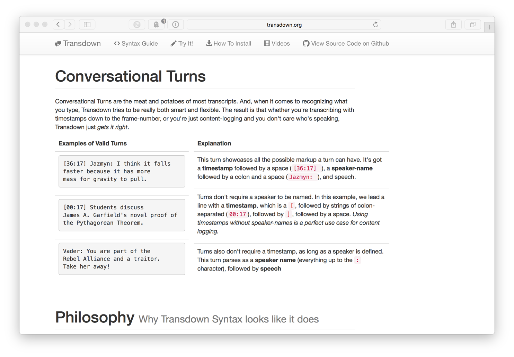
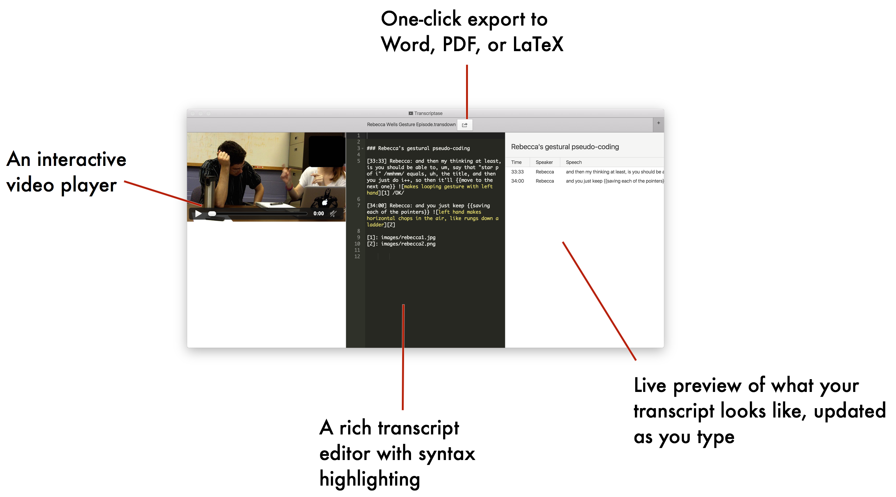

## My proposal and Budget for an **Innovation Grant**

I'm[^1] requesting **$2000** in funding to extend my previous PERTG grant work ([Transdown](www.transdown.org)) and develop **Transcriptase** a free, cross-platform application for editing and sharing transcripts. All of my grant funding would go to pay for my software development time (40 hours at $50/hr).

## What I accomplished with my past PERTG funding

All of my Fall 2014 funding ($750) went to pay for my individual software development hours. So far, I've been able to:

- Standardize a specification for Transdown. We’ve decided on a basic feature set including speakers, timestamps, speech, and rich media inclusion
- Build a back-end parser to convert Transdown text into formatted output options. Initially, that parser converts plaintext one-way to HTML. This parser is hosted on GitHub under an extremely permissive MIT License: anyone can use the transdown.js JavaScript parser for free.
- Design a professional-grade fully-responsive website: [Transdown.org](www.transdown.org), to showcase information, videos, and the source code for Transdown.
- Build a live sandbox where users can try out Transdown syntax and see the results rendered in real-time
- Create a series of videos to showcase the power, flexibility, and ease-of-use of Transdown.

## Plan: What I'll do

I'll create **Transcriptase**: a lightweight application that will:

- Be free for anyone to use
- Run on Windows, OS X, and Linux
- Provide a beautiful, tabular preview of your transcript that updates live as you type
- Allow users to export transcript into HTML, PDF, and Word formats

## Motivation: How does this help?

1. Transcriptase makes it easy for researchers to create beautiful, web-based presentations of transcript data
2. Researchers can embed images and animations into transcript displays with ease
3. It offers a "write once, run multiple places"[^6] approach. Researchers can write one transcript file in Transcriptase and instantly convert for presenting on the web, embedding in a \LaTeX\ file, or dropping into a Word document.
4. Transcriptase would be free for anyone to use, which helps put powerful tools in the hands of researchers who might not otherwise be able to afford more expensive, properietary solutions.

[^1]: Brian A. Danielak, Ph.D., <danie297@msu.edu>. I'm a postdoctoral research associate at Michigan State University in Computational Mathematics, Science, and Engineering (CMSE), supervised by Dr. Brian W. O'Shea.

